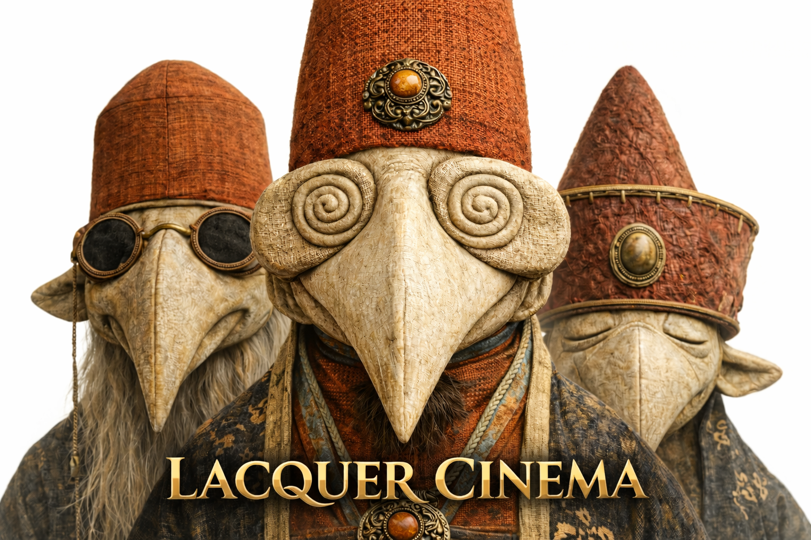

# Lacquer Cinema

This repository develops an experimental cinematic research program exploring lacquer not as an object of craft tradition, but as a temporal and material logic shaping visual narrative, cinematic perception, and artificial image systems.

Rather than treating cinema solely as a technological medium, this project approaches moving image as a material process grounded in deep-time aesthetics and layered material memory.

In this framework, lacquer becomes:

• A temporal structure for cinematic duration  
• A material logic of visual continuity  
• A deep-time archive of perception  
• A bridge between ancient craft and AI-generated imagery  
• A philosophical foundation for post-digital cinema  

The project integrates:

– film theory  
– material humanities  
– animation practice  
– AI image systems  
– narrative worldbuilding  
– experimental visual research  

Long-term objectives include:

• Developing lacquer-based cinematic language  
• Producing experimental films and animation  
• Constructing narrative universes grounded in material temporality  
• Connecting museum practice with cinematic production  
• Establishing lacquer cinema within global media theory discourse  

Author  
Jie Pang  
Alberta Lacquer Art & Media Center  
Calgary, Canada
